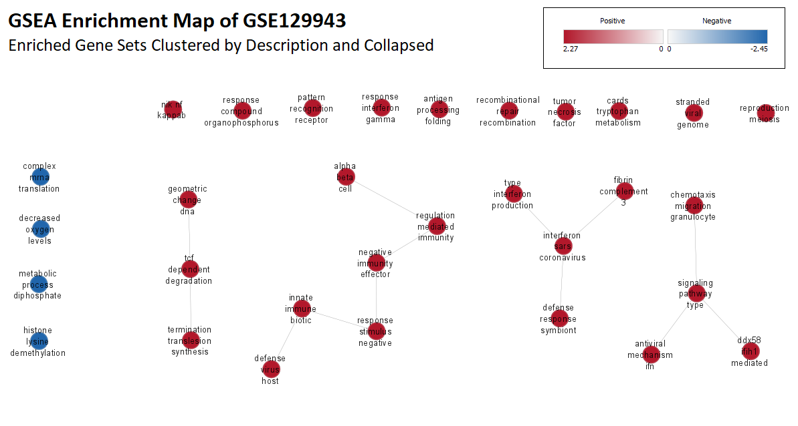

## Introduction

This report performs non-thresholded gene set enrichment analysis on expression 
data retrieved from GSE129943 and plots the results in an EnrichmentMap network.
Additionally, this report performs a dark matter analysis of the GSE129943 
dataset. The publication that produced this dataset can be accessed on the 
[_Cell_ website](https://www.cell.com/cell/fulltext/S0092-8674(19)30741-X?_returnURL=https%3A%2F%2Flinkinghub.elsevier.com%2Fretrieve%2Fpii%2FS009286741930741X%3Fshowall%3Dtrue) [@dvela2019]. 
This report builds on top of "Assignment 1: Dataset Selection and Initial 
Processing" and "Assignment 2: Differential Gene Expression and Preliminary 
Gene Set Enrichment Analysis", which can be downloaded and read at the following links: [A1](https://github.com/bcb420-2022/Evgeniya_Gorobets/blob/main/Assignment1.html),
[A2](https://github.com/bcb420-2022/Evgeniya_Gorobets/blob/main/Assignment2.html). 
The first report cleaned the bulk RNASeq data from GSE129943, removing any 
low-count and duplicated genes. Additionally, Assignment 1 performed TMM 
normalization on the read counts, visualized the normalized counts using MDS 
plots, mean-variance plots, and distribution curves. The final dataset produced 
by the A1 report had 14,241 genes and six samples, three of which are 
replicates of normal human kidney cells and three of which are replicates of 
Muc1 Kidney Disease (MKD) cells. The second report performed differential 
gene expression analysis using the `edgeR` package [@robinson2010; @mccarthy2012; @chen2016] 
and did a preliminary over-representation analysis (ORA) using g:Profiler 
[@gprofiler2; @raudvere2019]. This report will perform a fuller gene set 
enrichment analysis (non-thresholded, whereas A2 used thresholded analysis) 
and identify key motifs and pathways enriched in MKD samples, as well as 
address any DEGs that do not appear in the enrichment results.


### Acknowledgements

This R Notebook was developed by Evgeniya Gorobets as part of an assessment for 
2022 BCB420H: Computational Systems Biology, University of Toronto, Toronto, CA.
Specifically, this notebook was the final submitted product for Assignment 3 
of the course.
The journal entries accompanying this R Notebook are listed below.

* [3.5 Non Thresholded Gene Set Enrichment Analysis in my GEO Dataset](https://github.com/bcb420-2022/Evgeniya_Gorobets/wiki/3.5-Non-Thresholded-Gene-Set-Enrichment-Analysis-in-my-GEO-Dataset)
* [3.6 Visualizing GSEA Results with Cytoscape and EnrichmentMap](https://github.com/bcb420-2022/Evgeniya_Gorobets/wiki/3.6-Visualizing-GSEA-Results-with-Cytoscape-and-EnrichmentMap)
* [3.7 Dark Matter Analysis](https://github.com/bcb420-2022/Evgeniya_Gorobets/wiki/3.7-Dark-Matter-Analysis)
* [3.8 A3 Report](https://github.com/bcb420-2022/Evgeniya_Gorobets/wiki/3.8-A3-Report)

### Contributions

This report was created in R [@baseR] with the `knitr` [@xie2013; 
@xie2017; @xie2018] and `kableExtra` packages [@kableExtra].
The GSEA software [@subramanian2005] was used to run gene set enrichment analysis.
`GSA` [@gsa] was used to load and read GMT files to aid in GSEA and EnrichmentMap building.

Cytoscape [@shannon2003], `RCy3` [@RCy3], EnrichmentMap [@merico2010], and 
AutoAnnotate [@kucera2016] were used to create, annotate, and visualize the 
enrichment maps.

`ComplexHeatmap` [@complexheatmap] was used to generate heatmaps of dark 
matter identified in the expression data.
`BiocManager` [@biocmanager; @biobase] was used to install `RCy3` and `ComplexHeatmap`.
The pipe operator from `magrittr` [@magrittr] was used to improve the 
readability of the code.
The report was created inside a Docker image [@merkel2014] whose base is 
Rocker [@rocker].


The packages used in Assignments 1 and 2 (the precursors to this report, sourced 
at the beginning of this notebook) include `edgeR` [@robinson2010; @mccarthy2012; @chen2016],
`ggplot2` [@ggplot2], `ComplexHeatmap` [@complexheatmap], `circlize` [@circlize],
`gprofiler2` [@gprofiler2; @raudvere2019], `plotly` [@plotly], `GEOquery` 
[@geoquery], `biomaRt` [@durinck2005; @durinck2009], and `colorRamps` [@colorramps]. 


### Set-Up

There are three ways to run this notebook:

1. **Fully automated.** This version will run the full GSEA and EnrichmentMap 
pipeline without relying on having any data files present _a priori_. To run 
the report this way, the following requirements must be fulfilled:
    * You must run this notebook within a Docker that has GSEA installed, such as 
    `risserlin/em_base_image`. The path to the GSEA installation must be 
    specified in the `gseaPath` parameter set in the code chunk below.
    * It is recommended that you download the KEGG pathways GMT file from MSigDB to 
    the data directory. The notebook will run without it, but those pathways will 
    be omitted from the analysis.
    * You must have Cytoscape installed on your computer and it must be open and 
    running when the notebook is compiled. Ideally, Cytoscape should be version 
    3.9.1+, must have CyREST installed, and should have EnrichmentMap and 
    AutoAnnotate installed (the notebook will attempt to install any missing 
    apps but it is more reliable to install yourself so that you can 
    troubleshoot if required).
    * If running inside a Docker, you must ensure that the `baseUrl` 
    variable, defined in the code chunk below, points to the correct port on your 
    local machine in order to interface with CyREST. Additionally, the Docker should 
    be connected to a volume where you can store data files and figures generated 
    in the notebook. In order for Cytoscape to save images to the volumes, you 
    must provide the path on your local machine that is mapped to the Docker volume. 
    This path should be assigned to the `volumePath` variable below.
    * If this notebook is not being run inside a Docker, then setting 
    `baseUrl` to "http://localhost:1234/v1" and `volumePath` to `getwd()` should 
    suffice.
2. **Non-automated.** If you do not wish to set up GSEA and Cytoscape, then please 
pull down the data and figures directories located at https://github.com/bcb420-2022/Evgeniya_Gorobets/tree/main. 
The R Notebook will detect that all the files are already present and will not 
try to rerun any of the analysis.
3. **Semi-automated.** If you want to generate the Cytoscape network plots 
automatically but do not want to rerun the GSEA (since it takes a while), then 
please pull down the data directory from https://github.com/bcb420-2022/Evgeniya_Gorobets/tree/main/data 
so that the R has GSEA result files with which to build its Enrichment Map.

For any of the above methods, the references folder, 
located at https://github.com/bcb420-2022/Evgeniya_Gorobets/tree/main/references,
should still be pulled down, so that RNotebook can compile the bibliography and in-text citations.
A2_EvgeniyaGorobets.Rmd and Assignment1.Rmd must also both be pulled down 
from https://github.com/bcb420-2022/Evgeniya_Gorobets/tree/main, because 
R Notebook sources these child documents and builds on their results. 
Finally, the image at https://github.com/bcb420-2022/Evgeniya_Gorobets/tree/main/figures/emFinal.png
should be pulled down, since this image was manully modified and cannot be reproduced 
programmatically.
  
<br/>

<details>
<summary>Click to see set-up code</summary>

```{r setup, warning=FALSE, message=FALSE, error=FALSE}
# Install required packages
if (!requireNamespace("kableExtra", quietly = TRUE)) {
  install.packages("kableExtra")
}
if (!requireNamespace("BiocManager", quietly = TRUE)) {
  install.packages("BiocManager")
}
if (!requireNamespace("RCy3", quietly = TRUE)) {
  BiocManager::install("RCy3")
}
if (!requireNamespace("GSA", quietly = TRUE)) {
  install.packages("GSA")
}
if (!requireNamespace("magrittr", quietly = TRUE)) {
  install.packages("magrittr")
}
library(magrittr)


# Source child reports
a2 <- knitr::knit_child('A2_EvgeniyaGorobets.Rmd', quiet=T)
# Sourcing will take up a lot of memory so remove everything except what you need
dontRemove <- c("normalizedCounts", "qlfAdjusted", "veryUpRegORA", 
                "veryDownRegORA", "plotHeatmap")
rm(list=setdiff(ls(), dontRemove))


# Define key file paths
dataDir <- 'data'
figuresDir <- "figures"
volumePath <- "C:/Users/Evgeniya/Documents/University of Toronto/BCB420/code/"
baseUrl <- "http://host.docker.internal:1234/v1"
gseaPath <- "../GSEA_4.1.0/gsea-cli.sh"


# Check for GSEA results 
gseaOutputDir <- "a3_gsea"
gseaDir <- grep(gseaOutputDir, list.files(dataDir), value=T)
if (length(gseaDir) == 0) {
  if (!file.exists(gseaPath)) {
    stop(paste("Could not find GSEA installation at", gseaPath,
               "and could not find GSEA results in", dataDir))
  } else {
    runGsea <- TRUE
  }
} else if (length(gseaDir) >= 1) {
  runGsea <- FALSE
  # Get most recent results
  gseaDir <- sort(gseaDir, decreasing=TRUE)
  gseaDir <- gseaDir[1]
}


# Check for Cytoscape
requiredCytoFigs <- paste0(
  "a3_network", c("", "_clusters_expanded", "_clusters_expanded_cose",
                  "_clusters_collapsed", "_motif1"), ".png")
requiredCytoTables <- c("emStats.rds", "nodeTable.rds", "clusterNodeTable.rds",
                        "clusterMap.rds", "motif1GeneSets.rds")
allFilesPresent <- all(file.exists(paste0(dataDir, "/", requiredCytoTables))) & 
  all(file.exists(paste0(figuresDir, "/", requiredCytoFigs)))

if (!allFilesPresent) {
  if(is.null(RCy3::cytoscapeVersionInfo(base.url=baseUrl))) {
    stop("Could not connect to Cytoscape")
  } else {
    # Connection with Cytoscape active
    runCytoscape <- TRUE
    # Install required apps
    for (app in c("EnrichmentMap", "AutoAnnotate")) {
      if (!grepl("status: Installed", RCy3::getAppStatus(app, base.url=baseUrl))) {
        RCy3::installApp(app, base.url=baseUrl)
      }
    }
  }
} else {
  # All the required figures and tables are present; no need to run Cytoscape
  runCytoscape <- FALSE
}
```

</details>

<br/>

## Non-Thresholded Gene Set Enrichment Analysis

### Creating a Ranked List

The first step to running a non-thresholded gene set enrichment analysis is 
to create a ranked list. I will rank my genes using the formula shown in class,
except instead of using the p-value I will use the Benjamini-Hochberg adjusted 
p-value (i.e., the FDR), since this is what I used in my thresholded analysis.
$$ rank = -log_{10}(FDR) * sign(logFC)$$

```{r rankList, warning=FALSE, message=FALSE}
# Rank genes
ranks <- -log10(qlfAdjusted$table$FDR) * sign(qlfAdjusted$table$logFC)
rankedList <- data.frame(ensembl_id = rownames(qlfAdjusted$table),
                         rank = ranks)
rankedList <- rankedList[order(-ranks), ]

# Save full ranked list
write.table(rankedList, paste0(dataDir, "/ensembl_genes_ranked.rnk"), 
            row.names=FALSE, quote=F, sep="\t")

# Map ensembl gene ids to hugo symbols (using original counts df)
rownames(normalizedCounts) <- normalizedCounts$Ensembl
rankedList$GeneName <- normalizedCounts[rankedList$ensembl_id, "HGNC"]
rankedList <- rankedList[, c("GeneName", "rank")]

# Remove genes with no hugo symbols
numGenesRemoved <- length(which(is.na(rankedList$GeneName)))
rankedList <- rankedList[!is.na(rankedList$GeneName), ]
rankFile <- paste0(dataDir, "/hugo_genes_ranked.rnk")
write.table(rankedList, rankFile, row.names=FALSE, quote=F, sep="\t")
```

Unfortunately, the gene sets are defined with HUGO symbols rather than 
Ensembl gene IDs, so we have to map our ranked list to HGNC symbols. 
From Assignment 1, we recall that not all genes mapped to a HUGO symbol, so 
this will force us to exclude `r numGenesRemoved` from the non-thresholded 
gene set enrichment analysis.

<br/>

### Gene Sets

In order to easily compare my thresholded and non-thresholded gene set 
analyses, I want to use the same gene sets when running GSEA as I did when 
using g:Profiler.

```{r, warning=FALSE, message=FALSE}
geneSetsDir <- paste0(dataDir, '/genesets/')

goFile <- paste0(geneSetsDir, 'gobp.gmt')
goUrl <- "http://download.baderlab.org/EM_Genesets/current_release/Human/symbol/GO/Human_GO_bp_no_GO_iea_symbol.gmt"

# NOTE: Downloading KEGG from GSEA is hard because they required sign in
# Make sure it is already downloaded before running this notebook
keggFile <- paste0(geneSetsDir, 'kegg.gmt')

wpFile <- paste0(geneSetsDir, 'wikipathways.gmt')
wpUrl <- "http://download.baderlab.org/EM_Genesets/current_release/Human/symbol/Pathways/Human_WikiPathways_April_01_2022_symbol.gmt"

reacFile <- paste0(geneSetsDir, 'reactome.gmt')
reacUrl <- "http://download.baderlab.org/EM_Genesets/current_release/Human/symbol/Pathways/Human_Reactome_April_01_2022_symbol.gmt"

geneSets <- data.frame(url=c(goUrl, wpUrl, reacUrl),
                       row.names=c(goFile, wpFile, reacFile))

for (geneSetFile in rownames(geneSets)) {
  if (!file.exists(geneSetFile)) {
    download.file(geneSets[geneSetFile, "url"], geneSetFile)
  }
}

```

The GO:BP [@ashburner2000go; @gene2021go], Reactome [@gillespie2022reactome], 
and WikiPathways [@martens2021wikipathways] GMT files are retrieved from BaderLabs. 
I am choosing to use the most recent versions, from April 1st, 2022. I could 
not find the KEGG pathways on the BaderLabs website, so I manually 
downloaded the most recent KEGG files from MSigDb [@kanehisa2000kegg; 
@kanehisa2019kegg; @kanehisa2021kegg; @liberzon2011]. The MSigDb version used 
is v7.5.1 (updated January 2022). I chose to use GO:BP pathways with no IEAs 
because that is what I used in my thresholded analysis and because there are 
enough significantly enriched gene sets without using IEAs.


### GSEA

Now with the rank file and the GMT files, I can run non-thresholded gene set 
enrichment analysis using the GSEA CLI. Note that the GSEA command will only 
run if a GSEA results directory does not already exist.

```{r, warning=FALSE, message=FALSE}
# Build out GSEA command
downloadedGeneSets <- paste0(geneSetsDir, list.files(geneSetsDir), collapse=',')
minSetSize <- 15
maxSetSize <- 200
gseaCommand <- paste(gseaPath, 'GSEAPreranked',
                     '-gmx', downloadedGeneSets, 
                     '-collapse No_Collapse -mode Abs_max_of_probes',
                     '-norm meandiv -nperm 1000 -rnd_seed timestamp',
                     '-rnk', rankFile, '-scoring_scheme weighted', 
                     '-rpt_label', gseaOutputDir, '-create_svgs false',
                     '-include_only_symbols true -make_sets true',
                     '-plot_top_x 20 -set_max', maxSetSize, 
                     '-set_min', minSetSize, '-zip_report false',
                     '-out', dataDir)
```

```{r, eval=runGsea, warning=FALSE, message=FALSE}
# NOTE: GSEA will only run if the gseaOutputDir doesn't exist yet
system(paste('chmod a+x', gseaPath))
system(gseaCommand)
gseaDir <- grep(gseaOutputDir, list.files(dataDir), value=T)
```

<br/>

### GSEA Summary and Analysis

To compare with our thresholded results, we will get the top five gene sets 
from the positive (MKD cells) and negative (normal cells) report.

```{r topGeneSets, warning=FALSE, message=FALSE}
# Load GSEA results
gseaFiles <- grep("gsea_report.*tsv", 
                  list.files(paste0(dataDir, "/", gseaDir)), value=T)
mkdReport <- grep("pos", gseaFiles, value=T)
normReport <- grep("neg", gseaFiles, value=T)

mkdDf <- read.delim(paste0(dataDir, "/", gseaDir, "/", mkdReport), 
                    check.names=F)
normDf <- read.delim(paste0(dataDir, "/", gseaDir, "/", normReport), 
                     check.names=F)

getGeneSetNames <- function(gsNames) {
  return( strsplit(gsNames, "%") %>% 
    lapply(function(name) {name[1]}) %>%
    unlist() %>%
    stringr::str_to_title() )
}

getGeneSetIds <- function(gsNames) {
  return( strsplit(gsNames, "%") %>% 
    lapply(function(name) {name[3]}) %>%
    unlist() )
}


topMkdGeneSets <- knitr::kable(
  data.frame("Accession ID"=getGeneSetIds(mkdDf$NAME[1:5]),
             "Gene Set Name"=getGeneSetNames(mkdDf$NAME[1:5]),
             check.names=F),
  caption="Top 5 enriched gene sets in MKD cells")

topNormGeneSets <- knitr::kable(
  data.frame("Accession ID"=getGeneSetIds(normDf$NAME[1:5]),
             "Gene Set Name"=getGeneSetNames(normDf$NAME[1:5]),
             check.names=F),
  caption="Top 5 enriched gene sets in normal cells")

kableExtra::kable_styling(
  knitr::kables(list(topMkdGeneSets, topNormGeneSets),
                caption=paste("Top Enriched Gene Sets in MKD vs. Normal Cells",
                              "(Non-Thresholded Analysis)")), 
  "condensed")
```

```{r topOraGeneSets, warning=FALSE, message=FALSE}
# Compare with thresholded results
getTopOraGeneSets <- function(ora) {
  geneSetDf <- ora$result
  geneSetDf <- geneSetDf[(geneSetDf$term_size <= 200 & 
                            geneSetDf$term_size >= 15), ]
  geneSetDf <- geneSetDf[order(geneSetDf$p_value, decreasing=F), ]
  return(geneSetDf)
}

topUpReg <- getTopOraGeneSets(veryUpRegORA)
topDownReg <- getTopOraGeneSets(veryDownRegORA)

upregDf <- knitr::kable(topUpReg[1:5, c("term_id", "term_name")],
                        caption="Top 5 Upregulated Gene Sets",
                        col.names=c("Accession ID", "Gene Set Name"), 
                        row.names=F)
downregDf <- knitr::kable(topDownReg[1:5, c("term_id", "term_name")],
                          caption="Top 5 Downregulated Gene Sets",
                          col.names=c("Accession ID", "Gene Set Name"), 
                          row.names=F)
kableExtra::kable_styling(
  knitr::kables(list(upregDf, downregDf),
                caption=paste("Top Enriched Gene Sets in MKD Cells",
                              "(Thresholded Analysis; FDR < 0.001)")),
  "condensed")
```


The top gene sets show impressive consistency with the thresholded results. The 
top 5 gene sets upregulated in MKD cells are the same in both the thresholded and 
non-thresholded analysis, albeit in a different order. Three of the top 5 gene 
sets downregulated in MKD cells (i.e., upregulated in normal kidney cells) are 
the same in the thresholded and non-thresholded results. The two gene sets that 
are significantly downregulated that don't seem to fit into the theme of translation 
are L13a-mediated translational silencing of Ceruloplasmin expression (REAC:R-HSA-156827) and 
Selenocysteine Synthesis (REAC:R-HSA-2408557). However, according to Reactome, 
REAC:R-HSA-156827 describes the circularization of mRNA during translation initiation 
and a process involving the 60s ribosome that has a silencing effect [@gillespie2022reactome].
On the other hand, selenocysteine synthesis encodes an amino acid which is used in 
translation. Thus, all top downregulated pathways are united by a common 
theme of translation, further showing the consistency of the thresholded and 
non-thresholded enrichment results.


To summarize my GSEA results, I have listed the top 5 enriched gene sets 
(both positive and negative) in Tables \@ref(tab:mkdGeneSets) and 
\@ref(tab:normGeneSets), as well as their most important properties (p-values, 
enrichment scores, leading edges, etc.).

```{r mkdGeneSets, warning=FALSE, message=FALSE}
getSummary <- function(geneSetDf, reportDir, positive=TRUE) {
  # Get stats
  summaryDf <- geneSetDf[1:5, c("NAME", "ES", "NES", "NOM p-val", "FDR q-val",
                                "FWER p-val")]
  # Load report for each gene set and compute extra stats
  extraStats <- lapply(summaryDf$NAME, function(gs) {
    reportFile <- grep(paste0(gs, ".*tsv"), list.files(reportDir), value=T)
    gsReport <- read.delim(paste0(reportDir, "/", reportFile), check.names=F)
    
    if (positive) {
      i <- 1
    } else {
      i <- nrow(gsReport)
    }
    topGene <- gsReport$SYMBOL[i]
    leadingEdgeSize <- length(which(gsReport$`CORE ENRICHMENT` == "Yes"))
    return(c(leadingEdgeSize, topGene))
  })
  summaryDf <- cbind(summaryDf, do.call(rbind, extraStats))
  
  summaryDf$`Gene Set ID` <- getGeneSetIds(summaryDf$NAME)
  summaryDf$`Gene Set Name` <- getGeneSetNames(summaryDf$NAME)
  summaryDf$NAME <- NULL
  
  names(summaryDf)[6:7] <- c("Size of Leading Edge", "Top Gene")
  
  return(summaryDf[, c(8, 9, 1:7)])
}

reportDir <- paste0(dataDir, "/", gseaDir)
kableExtra::kable_styling(
  knitr::kable(getSummary(mkdDf, reportDir, positive=T), digits=32,
               caption="Summary of GSEA Results (Gene Sets Enriched in MKD Cells)"),
  "condensed")
```

```{r normGeneSets, warning=FALSE, message=FALSE}
kableExtra::kable_styling(
  knitr::kable(getSummary(normDf, reportDir, positive=F), digits=32,
               caption="Summary of GSEA Results (Gene Sets Enriched in Normal Cells)"),
  "condensed")
```


I notice that the top gene in most of the top gene sets is the same; in 
positively enriched gene sets, the top gene is either IFI27 or IFITM1, and in 
negatively enriched gene sets, the top gene is RPSA. 
IFI27 is Interferon alpha-inducible protein 27 (mitochondrial); it is part of 
type-I interferon-induced apoptosis. This aligns which our enriched gene sets:
the interferon signaling pathways are necessary to induce apoptosis, and 
apoptosis is a common defense to viruses. 
IFITM1 is Interferon-induced transmembrane protein 1, and it inhibits the entry 
of viruses to the host cell cytoplasm. This also aligns well with the 
viral-related gene sets in the enrichment results.
Finally, RPSA is 40S ribosomal protein SA, which explains why it is the top gene 
in translation-related gene sets.

<br/>

## Enrichment Map

### Building and Visualizing the Enrichment Map

Because the EnrichmentMap CLI only expects a single GMT file, I will first merge 
all the GMT files used for GSEA into a single file. 

```{r merge-gmts, warning=FALSE, message=FALSE}
# Merge all GMTs into one GMT file
combinedGmtFile <- paste0(dataDir, "/all_gene_sets.gmt")
strsplit(downloadedGeneSets, ",") %>% 
  unlist() %>%
  lapply(function(geneSetFile) { return( readLines(geneSetFile) ) }) %>% 
  unlist() %>% 
  writeLines(combinedGmtFile)

# Save network name for later
networkName <- paste0("A3-EM-Network")
```

Now, using this combined GMT file, I an create the Enrichment Map. Note that 
the code chunk below will only run if images of the Enrichment Map aren't already saved 
in the figures directory and if R detects a running session of Cytoscape.

I chose to use the default parameters for the enrichment map because it produced 
the most readable and interpretable graph during my research.

```{r buildNetwork, eval=runCytoscape, warning=FALSE, message=FALSE}
# Build out EnrichmentMap command
pvalue=0.005
qvalue=0.1
simMetric="COMBINED"
threshold=0.375

# Running Cytoscape outside the docker container requires full file paths on 
# the local machine
gmtFilePath <- paste0(volumePath, combinedGmtFile)
rankFilePath <- paste0(volumePath, rankFile)
gseaResultsFilePath <- paste0(volumePath, reportDir, "/edb/results.edb")

emCommand <- paste0('enrichmentmap build analysisType=GSEA ',
                    'gmtFile="', gmtFilePath, '"',
                    ' pvalue=', pvalue, ' qvalue=', qvalue,
                    ' similaritycutoff=', threshold,
                    ' coefficients=', simMetric, 
                    ' ranksDataset1="', rankFilePath, '"',
                    ' enrichmentsDataset1="', gseaResultsFilePath, '"',
                    ' filterByExpressions=false')

networkId <- RCy3::commandsGET(emCommand, base.url=baseUrl)
networkId <- as.numeric(networkId)

# Rename network
RCy3::renameNetwork(title=networkName, network=networkId, base.url=baseUrl)
```


Now, I want to visualize the EnrichmentMap. To ensure that the entire network 
is captured in an image, I need to use the functions `RCy3::fitContent()` and 
`RCy3::exportImage()`. Unfortunately, both of these functions rely on the 
function `RCy3::getNetworkViewSuid()`, which calls `RCy3::getNetworkSuid()` 
without passing along the `base.url` argument. This bug means that invoking 
either `RCy3::fitContent()` or `RCy3::exportImage()` from within the Docker 
container results in a refused connection error. Therefore, I had to 
implement my own versions of `getNetworkViewSuid()`, `fitContent()`, and 
`exportImage()`, which roughly match the functionality of the original `RCy3` 
functions but without the `base.url` bug. To avoid cluttering the report, I 
have placed my implementations of these functions in the collapsible section 
below.

<details>
<summary>Click to see `RCy3` function replacements</summary>

```{r rcy3-bug-fixes, warning=FALSE, message=FALSE}
fitContent <- function(selected.only=FALSE, network=NULL, base.url=baseUrl) {
    view.SUID <- getNetworkViewSuid(network,base.url)
    if(selected.only){
        RCy3::commandsPOST(paste0('view fit selected view=SUID:',view.SUID), 
                           base.url = base.url)
    } else {
        RCy3::commandsPOST(paste0('view fit content view=SUID:',view.SUID), 
                           base.url = base.url)
    }
}

getNetworkViewSuid <- function(network = NULL, base.url=baseUrl) {
    net.SUID <- RCy3::getNetworkSuid(network, base.url)
    any.views <- RCy3::getNetworkViews(net.SUID, base.url)
    
    if(is.null(any.views)){
        return(NULL)
    }
    else if(length(any.views)>1) {
        message("Warning: This network has multiple views. Returning last.")
        tail(any.views,n=1)
    } else {
        any.views
    } 
}

exportImage <- function(filename, type="PNG", resolution=NULL, units=NULL, height=NULL, 
                      width=NULL, zoom=NULL, network=NULL, base.url=.defaultBaseUrl, overwriteFile=TRUE){
    cmd.string <- 'view export' # a good start
    
    # view must be supplied
    view.SUID <- getNetworkViewSuid(network, base.url)
    
    # optional args
    if(!is.null(resolution))
        cmd.string <- paste0(cmd.string,' Resolution="',resolution,'"')
    if(!is.null(units))
        cmd.string <- paste0(cmd.string,' Units="',units,'"')
    if(!is.null(height))
        cmd.string <- paste0(cmd.string,' Height="',height,'"')
    if(!is.null(width))
        cmd.string <- paste0(cmd.string,' Width="',width,'"')
    if(!is.null(zoom))
        cmd.string <- paste0(cmd.string,' Zoom="',zoom,'"')
    
    ext <- paste0(".",tolower(type),"$")
    if (!grepl(ext,filename))
        filename <- paste0(filename,".",tolower(type))

    RCy3::commandsPOST(paste0(cmd.string,
                        ' OutputFile="',filename,'"',
                        ' options="',toupper(type),'"',
                        ' view=SUID:"',view.SUID,'"'), 
                 base.url = base.url)
}
```

</details>


Using my own versions of `fitContent()` and `exportImage()`, I can now define 
a function to capture and save an image of the Cytoscape network. Note that if 
an image of the network is already available, it will simply be displayed and a 
new image will not be created with Cytoscape. This goes for all figures in the 
rest of the report.

```{r initialNetwork, warning=FALSE, message=FALSE, out.width="100%", fig.cap="A network map illustrating the overlap betweeen enriched gene sets in GSE129943; generated automatically by EnrichmentMap and Cytoscape"}
visualizeEM <- function(emName, imgPath, parentDir) {
  if (!file.exists(imgPath)) {
    # Generate the image
    fitContent(network=emName)
    exportImage(paste0(parentDir, imgPath), type="png", base.url=baseUrl, 
                network=emName)
  }
  knitr::include_graphics(imgPath)
}

visualizeEM(networkName, paste0(figuresDir, "/a3_network.png"),
            volumePath)
```

The resulting enrichment map is shown in \@ref(fig:initialNetwork). Although 
it is very cluttered, it still shows shows defined clusters where each cluster 
clearly belongs to one of the two phenotypes (either all red 
nodes, indicating enrichment in MKD cells, or all blue nodes, 
indicating enrichment in normal kidney cells).

```{r networkStats, warning=FALSE, message=FALSE}
if (runCytoscape) {
  networkStats <- RCy3::analyzeNetwork(base.url=baseUrl)
  nodeTable <- RCy3::getTableColumns(table="node", network=networkName, 
                                     base.url=baseUrl)
  emStats <- data.frame("Num. Nodes"=networkStats['nodeCount'],
                        "Num. Edges"=networkStats['edgeCount'],
                        "Avg. Degree"=networkStats['avNeighbors'],
                        "Max. Degree"=max(nodeTable$Degree),
                        check.names=FALSE, row.names="")
  saveRDS(emStats, paste0(dataDir, "/emStats.rds"))
} else {
  emStats <- readRDS(paste0(dataDir, "/emStats.rds"))
}

kableExtra::kable_styling(
  knitr::kable(emStats, caption="Properties of GSE129943 Enrichment Map"),
  "condensed")
```

Table \@ref(tab:networkStats) shows the basic properties of the enrichment map,
such as the number of nodes and edges and the connectivity.

<br/>

### Annotating the Enrichment Map

Since I used four different pathway datasets in the gene set enrichment analysis, 
there is a lot of redundancy in the enrichment map. In order to identify similar 
pathways, I will use AutoAnnotate [@kucera2016],
a Cytoscape App developed by the BaderLab. I will cluster nodes by their 
descriptions (so that pathways with similar descriptions are collapsed into a 
single node) and use the default MCL clustering algorithm.

```{r network-clusters-expanded, warning=FALSE, message=FALSE, out.width="100%", fig.cap="An EnrichmentMap of enriched gene sets in GSE129943, clustered and annotated by AutoAnnotate using gene set descriptions."}
mapClustersToNodes <- function(clusterList) {
  clusterNames <- lapply(clusterList, function(cluster) {
    return(cluster$label)
  }) %>% unlist()
  clusters <- lapply(clusterList, function(cluster) {return(cluster$nodes)})
  names(clusters) <- clusterNames
  return(clusters)
}

if (runCytoscape) {
  # Set annotation parameters
  clusterAlgo <- "MCL"
  labelColumn  <- "EnrichmentMap::GS_DESCR"
  useClusterMaker <- "true"

  annotateCmd <- paste0("autoannotate annotate-clusterBoosted", 
                        " clusterAlgorithm=", clusterAlgo,
                        " labelColumn=", labelColumn,
                        " useClusterMaker=", useClusterMaker,
                        " network=")
  clusters <- RCy3::commandsPOST(paste0(annotateCmd, networkName), base.url=baseUrl)
  clusterMap <- mapClustersToNodes(clusters)
  saveRDS(clusterMap, paste0(dataDir, "/clusterMap.rds"))
} else {
  clusterMap <- readRDS(paste0(dataDir, "/clusterMap.rds"))
}

clusterImgFile <- paste0(figuresDir, 
                         "/a3_network_clusters_expanded.png")
visualizeEM(networkName, clusterImgFile, volumePath)
```

Figure \@ref(fig:network-clusters-expanded) shows the initial clusters 
drawn by AutoAnnotate. Since this network is very cluttered, we will use the 
CoSE layout algorithm to rearrange the nodes.

```{r network-clusters-expanded-cose, warning=FALSE, message=FALSE, out.width="100%", fig.cap="An EnrichmentMap of enriched gene sets in GSE129943, clustered and annotated by AutoAnnotate using gene set descriptions and laid out using the CoSE layout algorithm."}
if (runCytoscape) {
  layoutCmd <- paste0("autoannotate layout layout=CoSE network=", networkName)
  RCy3::commandsGET(layoutCmd, base.url=baseUrl)
}

clusterCoseImgFile <- paste0(
  figuresDir, "/a3_network_clusters_expanded_cose.png")
visualizeEM(networkName, clusterCoseImgFile, volumePath)
```

The enrichment map in Figure \@ref(fig:network-clusters-expanded-cose) is much 
easier to read (with some zooming) and exposes some key motifs within the network, which I will 
investigate further in the next section.

```{r clusterStats, warning=FALSE, message=FALSE}
if (runCytoscape) {
  nodeTable <- RCy3::getTableColumns(table="node", network=networkName, 
                                     base.url=baseUrl)
  saveRDS(nodeTable, paste0(dataDir, "/nodeTable.rds"))
} else {
  nodeTable <- readRDS(paste0(dataDir, "/nodeTable.rds"))
}

clustersPerNode <- nodeTable[, "__mclCluster"]
numUnclustered <- length(which(is.na(clustersPerNode)))
numClusters <- length(clusterMap)
nodesPerCluster <- table(clustersPerNode)
```

The code chunk above helps summarize key properties of the clustered 
enrichment map shown in Figure \@ref(fig:network-clusters-expanded-cose). 
In total, there are `r numClusters` clusters in the network. The biggest 
cluster is "tcf dependent degradation", which `r max(nodesPerCluster)` nodes. 
The mean and median cluster sizes are `r mean(nodesPerCluster)` and 
`r median(nodesPerCluster)`, respectively. Finally, there are 
`r numUnclustered` unclustered nodes. 

<br/>

### Motifs in the Enrichment Map

Now, I will examine some of the more prominent motifs in the annotated 
enrichment map. Below are helpers that I will use.

```{r motifHelpers, warning=FALSE, message=FALSE}
# Helpers
getNodesInClusters <- function(clusterNames) {
  return( clusterMap[clusterNames] %>% unlist() %>% setNames(c()) )
}
removeNodeLabels <- function() {
  RCy3::setNodeLabelOpacityDefault(0, style.name="EM1_Visual_Style", 
                                   base.url=baseUrl)
}
showNodeLabels <- function() {
  RCy3::setNodeLabelOpacityDefault(220, style.name="EM1_Visual_Style", 
                                   base.url=baseUrl)
}
```

<br/>

#### Motif 1: Immune Response

The first motif I will examine is the long pathway between the clusters 
"alpha beta cell", "regulation mediated immunity", 
"negative immunity effector", "response stimulus negative", 
"innate immune biotic", and "defense virus host". This is the most prominently 
connected set of clusters in the enrichment map, so it is important to examine 
which gene sets it contains.

```{r motif1Network, warning=FALSE, message=FALSE, out.width="100%", fig.cap="A subset of the EnrichmentMap of GSE129943, containing a pathway of connected clusters relating to immune response."}
motif1 <- c("alpha beta cell", "regulation mediated immunity", 
            "negative immunity effector", "response stimulus negative", 
            "innate immune biotic", "defense virus host")

if (runCytoscape) {
  motif1Nodes <- getNodesInClusters(motif1)
  suid <- RCy3::createSubnetwork(nodes=motif1Nodes, network=networkName, 
                                 base.url=baseUrl)
  motif1Clusters <- RCy3::commandsPOST(paste0(annotateCmd, suid), 
                                       base.url=baseUrl)
  removeNodeLabels()
}

motif1ImgFile <- paste0(figuresDir, "/a3_network_motif1.png")
visualizeEM(as.numeric(suid), motif1ImgFile, volumePath)
```

```{r motif1GeneSets, warning=FALSE, message=FALSE}
geneSetClusterList <- function(clusterMap, networkId) {
  if (networkId == networkName) {
    nodeMap <- nodeTable
  } else {
    nodeMap <- RCy3::getTableColumns(table="node", network=networkId, 
                                     base.url=baseUrl)
  }
  
  clusterDf <- lapply(names(clusterMap), function(clusterName) {
    nodes <- clusterMap[[clusterName]]
    return(paste(nodeMap[as.character(nodes), "EnrichmentMap::GS_DESCR"], 
                 collapse="; "))
  }) %>% unlist()
  return(data.frame("Cluster Name"=names(clusterMap),
                    "Gene Sets"=clusterDf, check.names=FALSE))
}

if (runCytoscape) {
  motif1GeneSets <- geneSetClusterList(mapClustersToNodes(motif1Clusters), suid)
  saveRDS(motif1GeneSets, paste0(dataDir, "/motif1GeneSets.rds"))                                   
} else {
  motif1GeneSets <- readRDS(paste0(dataDir, "/motif1GeneSets.rds"))
}

kableExtra::kable_styling(
  knitr::kable(motif1GeneSets, caption="Gene Sets in Immune Response Motif"),
  "condensed")
```

Note that when I subset the network to only the gene sets in the motif and I re-clustered them, the 
annotations (i.e., cluster names) changed slightly, but not significantly. Figure 
\@ref(fig:motif1Network) shows how the gene sets within each cluster are 
connected, and Table \@ref(tab:motif1GeneSets) lists the exact gene sets within each 
cluster (since the names of the clusters are not very informative).

The motif network and table contain pathways that are very similar to the top 
upregulated gene sets listed in Table \@ref(tab:mkdGeneSets). Although none of the exact 
gene sets in Table \@ref(tab:mkdGeneSets) are contained in these clusters, it is clear 
from the descriptions and cluster labels that the gene sets in this motif are 
closely related to the top uregulated pathways. For example, the gene sets 
in the "defense virus host" cluster are clearly related to the "Defense Response To Virus" 
pathway from Table \@ref(tab:mkdGeneSets). Similarly, the "alpha beta cell" cluster 
is obviously related to the "Interferon Alpha Beta Signaling" gene set. 

In short, this motif reveals that the top 5 gene sets enriched in MKD cells are representative of 
many of the enriched gene sets in MKD cells. When looking at tables 
of enriched gene sets (whether in thresholded or non-thresholded analysis), usually we 
can only examine the top hits and are forced to ignore the less significantly 
enirched gene sets. However, because of gene overlap clustering and 
gene set description annotations, we can now easily summarize many similar enriched 
gene sets in a few words.

<br/>

#### Motif 2: Interferon Signaling

The second motif of interest is the pathway composed of the clusters 
"interferon sars coronavirus", "type interferon production", 
"defense response symbiont", and "fibrin complement 3". Unfortunately, when 
I try to subset the network to only these nodes and redraw the clusters, the 
names of the clusters change significantly. Therefore, I will only examine the 
motif by looking at the gene sets contained in each cluster, as shown in 
Table \@ref(tab:motif2GeneSets).

```{r motif2GeneSets, warning=FALSE, message=FALSE}
motif2 <- c("interferon sars coronavirus", "type interferon production", 
            "defense response symbiont", "fibrin complement 3")
knitr::kable(geneSetClusterList(clusterMap[motif2], networkName),
             caption="Gene Sets in Interferon Signaling Motif")
```

Similar to the Immune Response motif, this set of clusters captures the 
upregulated viral response of MKD cells. This motif actually contains two of the 
top five upregulated pathways in MKD cells: defense response to symbiont and 
defense response to virus. Additionally, the "interferon sars coronavirus" cluster, 
although containing some surprising SARS-CoV-2 related gene sets, also hints at how big a role 
interferon signaling plays in MKD cells.

The novel SARS-CoV-2 related gene sets may be showing up as enriched in MKD cells because the 
human body responds similarly to a toxic proteinopathy as it does to a viral attack, so 
gene sets associated with responding to specific viruses appear enriched.

<br/>

#### Motif 3: TCF Dependent Degradation

The third motif I will examine is not a pathway but the largest cluster in the 
enrichment map. The "tcf dependent degradation" cluster contains 98 gene sets, 
all enriched in MKD cells, and 
yet the cluster name itself does not make a lot of sense. Thus, I listed the 
gene sets that compose this cluster in Table \@ref(tab:motif3GeneSets).

```{r motif3GeneSets, warning=FALSE, message=FALSE}
motif3 <- c("tcf dependent degradation")
nodes <- clusterMap[[motif3]] %>% as.character()
geneSets <- sort(nodeTable[nodes, "EnrichmentMap::GS_DESCR"])
knitr::kable(data.frame(geneSets[1:49], geneSets[50:98]),
             col.names = c(),
             caption="Gene Sets in TCF Dependent Degradation Motif")
```

<br/>
It seems that the gene sets in this cluster can roughly grouped into a few 
categories: degradation (of various forms), cell cycle (DNA replication, G1/G2/S/M), 
apoptosis, damage response, TCF and Interleukin signaling. It is not clear to me 
why all these gene sets formed one giant cluster. At minimum, this illustrates 
the complexity of cellular response to MKD. The fact that so many degradation pathways 
are enriched in MKD cells is surprising, since the original publication claims that 
that MKD occurs due to the failure of the cell to degrade excessive mutant 
Muc1-fs proteins [@dvela2019].

<br/>

#### Motif 4: Complex mRNA Translation

The final motif I will look at is the largest cluster that is enriched in 
normal cells, "complex mrna translation". All the previous motifs contained gene sets enriched in MKD cells; 
by contrast, this motif should reveal pathways that are suppressed in MKD cells.

```{r motif4GeneSets, warning=FALSE, message=FALSE}
motif4 <- c("complex mrna translation")
nodes <- clusterMap[[motif4]] %>% as.character()
geneSets <- sort(nodeTable[nodes, "EnrichmentMap::GS_DESCR"])
knitr::kable(data.frame(geneSets[1:15], geneSets[16:30]),
             col.names = c(),
             caption="Gene Sets in Complex mRNA Translation Motif")
```

<br/>
Table \@ref(tab:motif4GeneSets) contains 30 gene sets, which are all related to 
translation, either directly (e.g., eukaryotic translation initiation, peptide chain 
elongation) or indirectly (e.g., selenocysteine synthesis, nonsense-mediated decay). 
All five top gene sets enriched in normal cells, as listed in Table \@ref(tab:normGeneSets), are included 
in this cluster, once again demonstrating that the most significant gene sets 
are good representatives of the less significantly enriched gene sets. As I 
noted in Assignment 2, the downregulation of translation makes sense in MKD cells 
in that a cell suffering from an aggregation of misfolded proteins would want to 
respond by slowing down translation. However, these results aren't congruent with 
the results from the original publication, which either did not find or did not 
mention the downregulation of translation-related pathways in MKD cells [@dvela2019].

<br/>

### Collapsing the Network

To simplify this enrichment map further, I will now collapse the clusters 
t0 produce a theme network.

```{r network-clusters-collapsed, warning=FALSE, message=FALSE, out.width="100%", fig.cap="A collapsed EnrichmentMap of GSE129943, containing clusters derived by AutoAnnotate."}
if (runCytoscape) {
  summaryCmd <- paste0("autoannotate summary includeUnclustered=false network=", 
                       networkName)
  summaryNetworkId <- RCy3::commandsGET(summaryCmd, base.url=baseUrl)
  summaryNetworkName <- paste0(networkName, "-Summary")
  RCy3::renameNetwork(title=summaryNetworkName, 
                      network=as.numeric(summaryNetworkId), 
                      base.url=baseUrl)
  showNodeLabels()
}

summaryImgFile <- paste0(figuresDir, "/a3_network_clusters_collapsed.png")
visualizeEM(summaryNetworkName, summaryImgFile, volumePath)
```


The final step is to make this image publication ready. This was done manually 
by rearranging the nodes, adding a legend and a detailed title.

{width=100%}
<br/>

## Dark Matter Analysis

### Loading All Genes

To identify dark matter, I will first load in all the gene sets that I used 
during GSEA and concatenate them into a single mapping of gene set names to 
genes.

```{r getAllGeneSets, warning=FALSE, message=FALSE, include=FALSE}
allGMTs <- GSA::GSA.read.gmt(combinedGmtFile)
allGeneSets <- setNames(allGMTs$genesets, allGMTs$geneset.names)
rm(allGMTs)
```

Next, I need to get all the genes that were in the gene sets (i.e., all genes 
in my universe of genes).

```{r getAllGenes, warning=FALSE, message=FALSE}
allGenes <- allGeneSets %>% unlist() %>% unique()
```

Third, I want to get all genes that were present in my enriched gene sets. 

```{r getAllEnrichedGenes, warning=FALSE, message=FALSE}
allEnrichedGeneSets <- c(mkdDf$NAME, normDf$NAME)
genesInEnrichedSets <- allGeneSets[allEnrichedGeneSets] %>% unlist() %>% unique()
```

Finally, I want all genes that were in my expression data, which I can 
retrieve from my ranked list.

```{r getAllExpressedGenes, warning=FALSE, message=FALSE}
expressedGenes <- rankedList$GeneName
```

<br/>

### Finding Dark Matter

Now that I have retrieved and created all my gene lists, I can identify 
dark matter. I will consider four types of dark matter:

* Genes that did not map to HUGO symbols and were thus excluded from the GSEA
* Genes did not appear in any enriched gene sets
* Genes that have only IEAs
* Genes that have no annotations


To plot the gene expression of our dark matter genes, we will use the 
`plotHeatmap()` function defined in A2. 

```{r heatmapHelper, warning=FALSE, message=FALSE}
plotDarkMatterHeatmaps <- function(darkMatterGenes, sigGenes, countsMatrix) {
  sigDarkMatter <- intersect(darkMatterGenes, sigGenes)
  h1 <- plotHeatmap(countsMatrix[darkMatterGenes, ], 
                    title="All Dark Matter Genes")
  h2 <- plotHeatmap(countsMatrix[sigDarkMatter, ], 
                    title="Significantly Expressed Dark Matter Genes (FDR < 0.05)")
  return(list(h1, h2))
}


getTopDegs <- function(qlfTable, genes, n=3) {
  degDf <- qlfTable[genes, ]
  degDf <- degDf[order(degDf$FDR, decreasing=FALSE), ]
  return(degDf[1:3, c("logFC", "FDR")])
}

counts <- as.matrix(normalizedCounts[3:8])
rownames(counts) <- normalizedCounts$Ensembl
sigGenes <- rownames(qlfAdjusted$table)[qlfAdjusted$table$FDR < 0.05]
```

<br/>

#### Unmapped Genes

The first type of dark matter I will identify are genes that did not map to 
HUGO symbols and were thus excluded from the GSEA.

```{r unmappedGenesHeatmap, warning=FALSE, message=FALSE, fig.show="hold", out.width="50%", fig.cap="Scaled and Normalized Gene Expression of Unmapped Genes"}
unmappedGenes <- normalizedCounts$Ensembl[is.na(normalizedCounts$HGNC)]
plotDarkMatterHeatmaps(unmappedGenes, sigGenes, counts) 
```

There are `r length(unmappedGenes)` genes that did not map to HUGO 
symbols (Figure \@ref(fig:unmappedGenesHeatmap), left),
of which `r length(intersect(unmappedGenes, sigGenes))` had significant 
differential expression (Figure \@ref(fig:unmappedGenesHeatmap), right). The second 
heatmap clearly shows that some of the unmapped genes were strongly differentially 
expressed. To examine this more closely, I will look at the three most 
significant DEGs in the set of unmapped genes. The most 
significant unmapped genes are shown in Table \@ref(tab:topUnmappedGenes) below.

```{r topUnmappedGenes, warning=FALSE, message=FALSE}
kableExtra::kable_styling(
  knitr::kable(getTopDegs(qlfAdjusted$table, unmappedGenes), digits=32,
               caption="Top 3 DEGs in GSE129943 that don't map to HUGO Symbols"),
  "condensed")
```

To understand this dark matter better, I searched up the genes listed in 
Table \@ref(tab:topUnmappedGenes) in Enesmbl and UniProt [@ensembl; @uniprot].


**ENSG00000152268** 

This gene ID was archived. It previously represented SPON1, 
which is now mapped to ENSG00000262655 instead [@ensembl]. According to UniProt, SPON1 
is annotated to several GO:BP and Reactome pathways, including cell adhesion (GO:0007155),
negative regulation of amyloid-beta formation (GO:1902430), positive regulation of protein 
binding (GO:0032092), and O-glycosylation of TSR domain-containing proteins (R-HSA-5173214) [@uniprot].
R-HSA-5173214, GO:1902430, and GO:0032092 were all listed in the positive 
enrichment results, but all had high FDRs (0.5686362, 0.5039948, and 0.8436585, respectively).
None of these gene sets are particularly informative or closely related to the 
pathways discussed in the original publication [@dvela2019].


**ENSG00000152726** 

This gene ID is archived. It previously mapped to the 
HGNC symbol FAM21B, which was withdrawn [@ensembl]. It seems as though the new symbol for 
the gene at this chromosomal location is WASHC2A, which maps to ENSG00000099290 [@ensembl].
According to UniProt, this gene is not annotated in any Reactome pathways, but 
it is part of some interesting GO:BP pathways: protein localization to 
endosome (GO:0036010), protein transport (GO:0015031), retrograde transport, 
endosome to Golgi (GO:0042147) [@uniprot]. These gene sets are particularly interesting 
because they are synonymous with the enriched pathways discussed in the original 
publication [@dvela2019]. GO:0042147 (endosome to Golgi retrograde transport) 
is in the negative enriched results, with a significant p-value (0.04320988) 
that does not pass correction (FDR q-value = 0.563073). 


**ENSG00000215781**

This gene ID is archived. It previously mapped to gene AC011043.1, which 
produced an uncharacterized protein that was not associated with any HGNC 
symbols [@ensembl]. No successors or associated IDs were listed on Ensembl, so further 
investigation was not possible.

<br/>

#### Unenriched Genes

The next type of dark matter I will investigate genes did not appear in any 
enriched gene sets. This is the broadest category of dark matter and encompasses 
genes without annotations, genes with only electronically inferred annotations, 
and genes that are only annotated to very large or very small gene sets that 
were filtered out during GSEA.

```{r unenrichedGenesHeatmap, warning=FALSE, message=FALSE, fig.show="hold", out.width="50%", fig.cap="Scaled and Normalized Gene Expression of Genes not in Enriched Gene Sets"}
unenrichedGenes <- setdiff(expressedGenes, genesInEnrichedSets)
unenrichedGenesEnsembl <- 
  normalizedCounts$Ensembl[normalizedCounts$HGNC %in% unenrichedGenes]
plotDarkMatterHeatmaps(unenrichedGenesEnsembl, sigGenes, counts)
```

There are `r length(unenrichedGenes)` genes that did not appear in any enriched 
gene sets (Figure \@ref(fig:unenrichedGenesHeatmap), left),
of which `r length(intersect(unenrichedGenesEnsembl, sigGenes))` had significant 
differential expression (Figure \@ref(fig:unenrichedGenesHeatmap), right). 
Again, the second heatmap demonstrates a strong signal amongst some of the 
dark matter, so it is important to take a closer look at the DEGs in this 
subset of dark matter. The most significant genes that did not show up 
in the enriched gene sets are shown in Table \@ref(tab:topUnenrichedGenes) below.

```{r topUnenrichedGenes, warning=FALSE, message=FALSE}
kableExtra::kable_styling(
  knitr::kable(getTopDegs(qlfAdjusted$table, unenrichedGenesEnsembl), digits=32,
               caption="Top 3 DEGs in GSE129943 that don't appear in any enriched gene sets"),
  "condensed")
```

Again, I investigated this dark matter by searching for the genes in 
Table \@ref(tab:topUnenrichedGenes) in Enesmbl and UniProt [@ensembl; @uniprot].

```{r, warning=FALSE, message=FALSE}
# Helpers for analysis
getGeneSetsWithGene <- function(geneSymbol) {
  geneSets <- c()
  for (gsName in names(allGeneSets)) {
    if (geneSymbol %in% allGeneSets[[gsName]]) {
      geneSets <- c(geneSets, gsName)
    }
  }
  return(geneSets)
}

getGeneSetSize <- function(gsName) {
  return(length(allGeneSets[[gsName]]))
}
```


**ENSG00000106066 (CPVL)**

This gene showed up in `r length(getGeneSetsWithGene("CPVL"))` of the gene 
sets in our GMT files, indicating that it was not annotated to any of our pathways.
According to UniProt, this gene is annotated with the GO molecular function 
GO:0004185 (serine-type carboxypeptidase activity) [@uniprot]. There are 
`r length(grep("peptidase", mkdDf$NAME, ignore.case = T))` gene sets in the 
positive enrichment results that contain "peptidase" in their name. It is 
possible that this gene belongs to one of the existing peptidase pathways, 
but this annotation is just not known yet. 


**ENSG00000165507 (DEPP1)**

This gene showed up in `r length(getGeneSetsWithGene("DEPP1"))` of the gene 
sets in our GMT files. However, of those gene sets, all 
`r length(which(unlist(lapply(getGeneSetsWithGene("DEPP1"), getGeneSetSize)) > 200))`
have more than 200 genes. In other words, although DEPP1 is annotated to some 
pathways, such as regulation of autophagy (GO:0010506) and regulation of cellular 
catabolic process (GO:0031329), these gene sets are too large and uninformative to 
have been used effectively in the gene set enrichment analysis.
According to UniProt, DEPP1 is also annotated to GO:0006914 (autophagy), which 
is a negatively enriched gene set, but the annotation is an IEA, so DEPP1 does 
not show up in the enrichment results [@uniprot].


**ENSG00000137965 (IFI44)**

This gene showed up in `r length(getGeneSetsWithGene("IFI44"))` of the gene 
sets in our GMT files. However, all of these gene sets are greater than 200 
genes, so they do not show up in the enrichment results.

<br/>


#### IEA Genes

Next, I will determine which genes had only IEA annotations and therefore 
were not found in enrichment results.

```{r ieaGmt, warning=FALSE, message=FALSE, include=FALSE}
# Get pathways including IEA annotations
ieaFile <- paste0(dataDir, '/gobp_iea.gmt')
ieaUrl <- "http://download.baderlab.org/EM_Genesets/current_release/Human/symbol/GO/Human_GO_bp_with_GO_iea_symbol.gmt"

if (!file.exists(ieaFile)) {
  download.file(ieaUrl, ieaFile)
}

# Get all genes listed in GO:BP pathways with IEAs
ieaGmt <- GSA::GSA.read.gmt(ieaFile)
ieaGenes <- ieaGmt$genesets %>% unlist() %>% unique()
```

```{r ieaGenesHeatmap, warning=FALSE, message=FALSE, fig.show="hold", out.width="50%", fig.cap="Scaled and Normalized Gene Expression of Genes that only have IEA Annotations"}
# Get genes listed ONLY in pathways with IEAs
ieaOnlyGenes <- setdiff(ieaGenes, allGenes)

# Get expression genes that only have IEAs
ieaExprGenes <- intersect(ieaOnlyGenes, expressedGenes)

# Map to ENSEMBL IDs and make heatmap
ieaGenesEnsembl <- 
  normalizedCounts$Ensembl[normalizedCounts$HGNC %in% ieaExprGenes]
plotDarkMatterHeatmaps(ieaGenesEnsembl, sigGenes, counts)
```

There are `r length(ieaOnlyGenes)` genes that only have IEA annotations for 
GO:BP pathways (Figure \@ref(fig:ieaGenesHeatmap), left),
of which `r length(intersect(ieaGenesEnsembl, sigGenes))` had significant 
differential expression (Figure \@ref(fig:ieaGenesHeatmap), right). 
The most significant IEA-annotated genes are listed in Table \@ref(tab:topIEAGenes) 
below.

```{r topIEAGenes, warning=FALSE, message=FALSE}
kableExtra::kable_styling(
  knitr::kable(getTopDegs(qlfAdjusted$table, ieaGenesEnsembl), digits=32,
               caption="Top 3 DEGs in GSE129943 that only have IEA annotations"),
  "condensed")
```

To explore the IEA genes further, I will define the following helper function.

```{r, warning=FALSE, message=FALSE}
getIeaGeneSets <- function(geneSymbol) {
  geneSets <- c()
  for (i in seq(length(ieaGmt$geneset.names))) {
    gsName <- ieaGmt$geneset.names[i]
    gs <- ieaGmt$genesets[[i]]
    if (geneSymbol %in% gs) {
      geneSets <- c(geneSets, gsName)
    }
  }
  return(geneSets)
}
```


**ENSG00000106066 (CPVL)**

Remark that CPVL was also in our top 3 genes which did not show up in 
enriched results. Now that I have pathways with IEA annotations, I can see that 
this gene is electronically annotated to `r length(getIeaGeneSets("CPVL"))` pathways.
However, the smallest of these gene sets is 
`r min(unlist(lapply(getIeaGeneSets("CPVL"), getGeneSetSize)))` genes large.
This indicates that this gene really is not annotated to any specific pathways, and that 
very little is known about its function.


**ENSG00000143416 (SELENBP1)**

SELENBP1 is electronically annotated to `r length(getIeaGeneSets("SELENBP1"))`
gene sets, the smallest of which has `r min(unlist(lapply(getIeaGeneSets("SELENBP1"), getGeneSetSize)))` genes.
The gene set names are very general, such as "biological process", "protein transport", 
and "protein localization". Similarly to CPVL, SELENBP1 does not seem to be annotated 
to any informative pathways.


**ENSG00000102271 (KLHL4)**

KLHL4 is electronically annotated to only `r length(getIeaGeneSets("KLHL4"))`
gene set, which is GO:0008150 (biological process). Even more so than the two genes 
above, it seems that despite the significant differential expression of KLKHL4, 
little to nothing can be inferred about the pathways it participates in.


<br/>


#### Unannotated Genes

The final type of dark matter I will look at are genes that have no pathway 
annotations whatsover (but do map to HGNC symbols).

```{r unannotatedGenesHeatmap, warning=FALSE, message=FALSE, fig.show="hold", out.width="50%", fig.cap="Scaled and Normalized Gene Expression of Unannotated Genes"}
# Get genes not found in any gene sets
unannotatedGenes <- setdiff(expressedGenes, allGenes)

# Remove IEA genes
unannotatedGenes <- setdiff(unannotatedGenes, ieaExprGenes)

# Map to ENSEMBL and plot
unannotedGenesEnsembl <- 
  normalizedCounts$Ensembl[normalizedCounts$HGNC %in% unannotatedGenes]
plotDarkMatterHeatmaps(unannotedGenesEnsembl, sigGenes, counts)
```

There are `r length(unannotatedGenes)` genes that mapped to HGNC symbols but 
that did not have any pathway 
annotations in my data sources (GO:BP, KEGG, WikiPathways, Reactome) 
(Figure \@ref(fig:unannotatedGenesHeatmap), left),
of which `r length(intersect(unannotedGenesEnsembl, sigGenes))` had significant 
differential expression (Figure \@ref(fig:unannotatedGenesHeatmap), right). 
The most significant unannotated HGNC genes are listed in Table \@ref(tab:topUnannotatedGenes) 
below.

```{r topUnannotatedGenes, warning=FALSE, message=FALSE}
kableExtra::kable_styling(
  knitr::kable(getTopDegs(qlfAdjusted$table, unannotedGenesEnsembl), digits=32,
               caption="Top 3 DEGs in GSE129943 that have HGNC symbols but no pathway annotations"),
  "condensed")
```

To learn more about these genes, I used Ensembl and UniProt [@ensembl; @uniprot].

**ENSG00000130224 (LRCH2)**

LRCH2 has no functional annotations on UniProt, not even to GO molecular functions [@uniprot]. 
UniProt simply states that LRCH2 
"[m]ay play a role in the organization of the cytoskeleton" [@uniprot].


**ENSG00000206337 (HCP5)**

HCP5 is listed in UniProt as an HLA class I histocompatibility antigen protein.
It also has no annoations, only some evidence of this gene helping control viremia 
in HIV patients [@uniprot].


**ENSG00000166578 (IQCD)**

According to UniProt, IQCD encodes a dynein regulatory complex protein [@uniprot].
It has no functional annotations but cellular compartment annotations reveal that it 
is located in the cytoplasm and ciliary basal body [@uniprot]. It is part of the
nexin-dynein regulatory complex (N-DRC) which regulates ciliary motility [@uniprot].

<br/>


## Discussion

Throughout the course of this investigation of GSE129943 (from Assignment 1 through 
Assignment 3), my analysis has been benefited greatly from strong sample separation and 
clear differential expression signals between MKD cells and normal kidney cells. 
As a result, the same patterns have shown up again and again during analysis. 
In particular, we have seen interferon signaling, 
viral response, and apoptosis consistently upregulated in MKD cells. On the other hand, we have 
repeatedly seen translation-related pathways downregulated in MKD cells. These patterns 
showed up when examining DEGs, in over-represented gene sets from thresholded analysis, in 
enriched gene sets from non-thresholded analysis, in the enrichment map, in the 
annotated clusters, and in prominent motifs. This consistency throughout my analysis 
indicates that there is not a lot of noise or biological variation in the dataset that 
would otherwise detract from the strong signals produced by MKD.

Unfortunately, my results, while very consistent with themselves, were not very congruent 
with the results in the original publication [@dvela2019]. In Assignment 2, I found 
that the genes that were supposedly significantly upregulated in @dvela2019 were 
not significantly upregulated in my normalized dataset. @dvela2019 discusses 
the increased activation of Unfolded Protein Response (UPR) in MKD cells and 
claims that retrograde vesicle transport from the Golgi to the ER played an 
important role in MKD. In Assignment 2, I found some, but very few, pathways related to 
UPR and retrograde traffic that were enriched. Tables \@ref(tab:retrogradeTable), 
\@ref(tab:retrogradeTable2), \@ref(tab:uprTable), and \@ref(tab:uprTable2) show 
similar results for the non-thresholded analysis. While pathways related to Golgi-to-ER 
retrograde traffic and UPR appeared in the enrichment results, none of them had 
significant FDRs. Of these pathways, the one with the highest p-value was 
retrograde transport, endosome to Golgi (GO:0042147, p-value=0.0238806). This 
shows some support for the conclusions in @dvela2019 but produces 
more questions than answers.

```{r retrogradeTable, warning=FALSE, message=FALSE}
kableExtra::kable_styling(
  knitr::kable(mkdDf[grep("retrograde", mkdDf$NAME, ignore.case=T), 
                     c("NAME", "ES", "NES", "NOM p-val", "FDR q-val")],
               caption="Gene Sets Enriched in MKD Cells That Have 'retrograde' in Their Name",
               row.names=F),
  "condensed")
```

```{r retrogradeTable2, warning=FALSE, message=FALSE}
kableExtra::kable_styling(
  knitr::kable(normDf[grep("retrograde", normDf$NAME, ignore.case=T), 
                      c("NAME", "ES", "NES", "NOM p-val", "FDR q-val")],
               caption="Gene Sets Enriched in Normal Kidney Cells That Have 'retrograde' in Their Name",
               row.names=F),
  "condensed")
```

```{r uprTable, warning=FALSE, message=FALSE}
kableExtra::kable_styling(
  knitr::kable(mkdDf[grep("unfolded protein response", mkdDf$NAME, ignore.case=T), 
                     c("NAME", "ES", "NES", "NOM p-val", "FDR q-val")],
               caption="Gene Sets Enriched in MKD Cells That Have 'unfolded protein response' in Their Name",
               row.names=F),
  "condensed")
```

```{r uprTable2, warning=FALSE, message=FALSE}
kableExtra::kable_styling(
  knitr::kable(normDf[grep("unfolded protein response", normDf$NAME, ignore.case=T), 
                      c("NAME", "ES", "NES", "NOM p-val", "FDR q-val")],
               caption="Gene Sets Enriched in Normal Kidney Cells That Have 'unfolded protein response' in Their Name",
               row.names=F),
  "condensed")
```

<br/>

It is very likely that my results would have been more aligned with the original 
publication if I had managed to map every single gene in the expression data to 
an HGNC symbol. As I mentioned in Assignment 1, the original publication used 
Ensembl version 75, which has many archived gene IDs. Because there is no programmatic 
way to find the new Ensembl ID of each archived gene, I simply excluded unmapped 
genes from my gene set enrichment analyses. However, my dark matter investigation 
revealed that many of the omitted genes were differentially expressed and annotated to 
significantly enriched pathways. Most notably, ENSG00000152726, which I mapped to 
gene WASHC2A, was annotated to endosome to Golgi retrograde transport and 
protein localization to endosome, which are both pathways mentioned by the authors 
of GSE129943 [@dvela2019]. This suggests that if I had included this type 
of dark matter in my analysis, I might have found that the UPR and retrograde 
transport pathways were significantly enriched after all.

The other types of dark matter did not seem as significant to the analysis. 
Many of the genes that did not make it into the enrichment results but that were 
mapped to HGNC symbols had very generic annotations, such as "biological process" 
or "protein transport". In particular, I found it interesting that most of the 
IEA annotations were to such generic gene sets. This suggests that omitting IEAs 
from my over-representation analysis was the correct choice, as they add little 
information but contribute to noise in the data. Some of the genes without 
any pathway annotations had high logFCs and extremely small FDRs; this dark 
matter is worth investigating in future studies, so as to identify which pathways 
these genes participate in.

In Assignment 2, I performed a thorough review of all existing literature about 
the mechanisms of MKD. I noted that this subset of biological literature is 
frustratingly small, and focused primarily on a review article by Sho Hasegawa 
and Reiko Inagi which discussed the role of 
UPR and other pathways in kidney disease [@hasegawa2020]. In short, @hasegawa2020 
discuss how ER stress in kidney cells, such as the ER stress caused by MKD, can result in apoptosis. 
This evidence is strongly supported by my results: the most significantly enriched 
pathway in MKD cells was Interferon Alpha Beta Signaling, which induces apoptosis. 
Similarly, the primary motifs in the Enrichment Map were related to viral response, 
defense response, interferon signaling, and immunity, all of which are closely 
tied to apoptosis.

To sum up, my gene set enrichment results show partial agreement with the 
original publishers of the data [@dvela2019] and partial agreement with 
existing evidence on MKD. Based on what is known about toxic proteinopathies, my 
enrichment results make sense on a big-picture level. Unfortunately, the lack of 
other evidence relating to MKD means that I cannot draw further conclusions 
about whether or not my results align with existing MKD literature. Further investigation 
of MKD is required.

<br/>

## References
